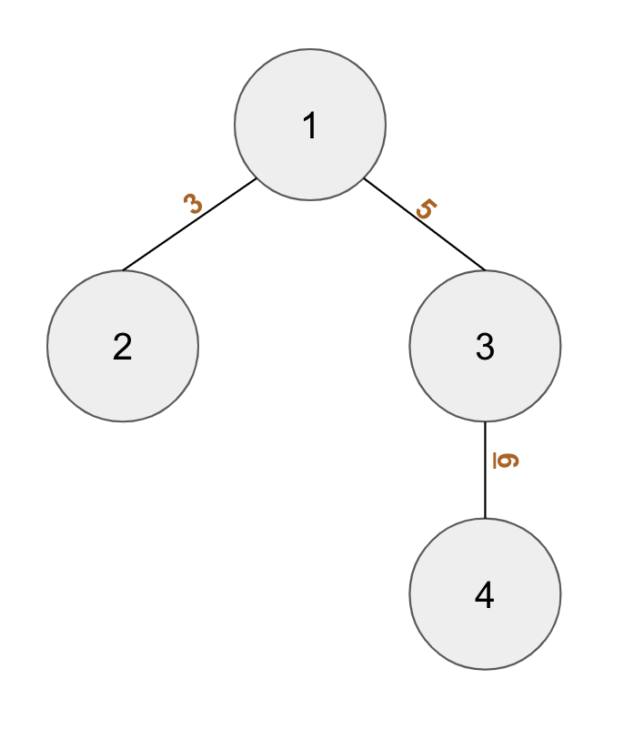

## Number Tree

Your colleague Alice came up with an interesting puzzle, and discussed with you to find out the solution together. 

The puzzle is in the form of an undirected tree graph with N nodes, with the following characteristics:

Each nodes are given a number from 1 to N
Each edges have a single digit integer written in it
An example of this trree would be the following picture:

The value of a path was defined as the concatenation of the number written in the edges of the path, starting from the node with lower number. For example, in the example above, the value from node 2 to node 3 is 35, and value from node 2 to node 4 is 356. Then, the puzzle is calcuating the sum of value from each possible path in the tree.

Can you write a program to solve this puzzle?

## Input

The first line contains 1 integer N (1 ≤ N ≤ 100,000), denoting the number of nodes.

The next N-1 line contains Ui Vi Ci (1 ≤ Ui, Vi ≤ N, 0 ≤ Ci ≤ 9), denoting an edge between node Ui and node Vi which has number Ci written in it. It is guaranteed that the given graph is a tree graph.

## Output

One line containing a single integer, the answer of this puzzle. Since this number can be very large, output its value modulo 10^9+7.

SAMPLE INPUT
4
1 2 3
1 3 5
3 4 6

SAMPLE OUTPUT
461

##### Explanation
The tree corresponds to the tree given in the description.

Below are all the possible values:

From node 1 to node 2 = 3
From node 1 to node 3 = 5
From node 1 to node 4 = 56
From node 2 to node 3 = 35
From node 2 to node 4 = 356
From node 3 to node 4 = 6
The sum of all of them is 461.